# 🐧💽 **Administrador de Discos en Linux/Ubuntu**
 

**📑 Indice**
- [🐧💽 **Administrador de Discos en Linux/Ubuntu**](#-administrador-de-discos-en-linuxubuntu)
  - [1. Gestor de Discos *``(GPARTED)``*](#1-gestor-de-discos-gparted)
  - [2. Inicializando Disco](#2-inicializando-disco)
  - [3. Particionando Disco *``gpt``*](#3-particionando-disco-gpt)
  - [4. Particionando Disco *``mbr``*](#4-particionando-disco-mbr)

 

En esta sección veremos cómo utilizar la herramienta gráfica Discos *``(gnome-disks)``* incluida en la mayoría de entornos de escritorio en Linux/Ubuntu.
Aprenderemos a :

  - 🖱️ Ver información detallada de discos y particiones

  - ➕ Crear y formatear nuevas particiones
  - 🗑️ Eliminar o modificar particiones existentes

  - 🔄 Montar, desmontar y cambiar opciones de arranque

Esta herramienta es ideal para quienes prefieren una interfaz visual sencilla , pero poderosa, para gestionar sus discos en Linux.

 

## 1. Gestor de Discos *``(GPARTED)``*
 

1 - Descargamos el gestor desde la la página oficial de Linux , usando el siguiente enlaces te lleva a esta ventana , a ahí puedes descargar el paquete o solo copiar el comando en el terminal y descargarlo . Nosotros utilizaremos el comando 

~~~~~~~~~~~~~~~~~~~~~~~~~~~~~~~~
https://gparted.org/download.php
~~~~~~~~~~~~~~~~~~~~~~~~~~~~~~~~

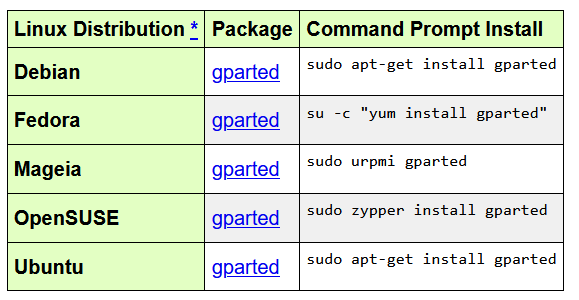
 
 

2 - En el terminal ejecutamos el comando y dejamos que se descargue nuestro gestor . Como se muestra en la imagen 

~~~~~~~~~~~~~~~~~~~~~~~~~~~~
sudo apt-get install gparted
~~~~~~~~~~~~~~~~~~~~~~~~~~~~

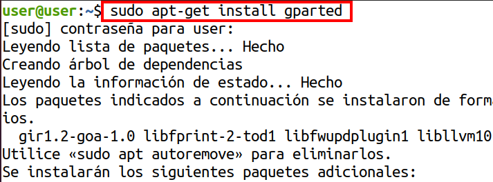
 
 

3 - Después buscamos nuestro disco en el terminal y eliminamos todo con el siguiente comando , esto para que nos quede libre . Ten encuentra que esto solo son pruebas y este disco es secundario .

~~~~~~~~~~~~~~~~~~~~~~~
sudo wipefs -a /dev/sdb
~~~~~~~~~~~~~~~~~~~~~~~

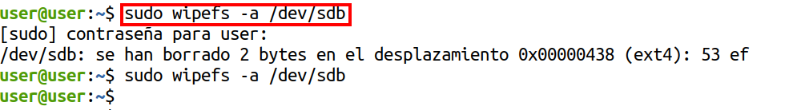
 
 

## 2. Inicializando Disco
 

1 - Entramos en Gparted y seleccionamos el disco nuevo y creamos una nueva partición . Con clic derecho a *``NUEVA``* , así como en la imagen .

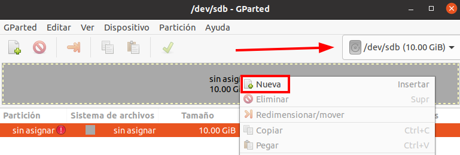
 
 

2 - Como podemos ver no nos deja , *``¿por qué?``* . Esto pasa porque no elegimos la tabla de particiones en en el disco , esto viene siendo *``INICIALIZAR EL DISCO EN WINDOWS``* , aquí se le conoce como tabla de particiones .

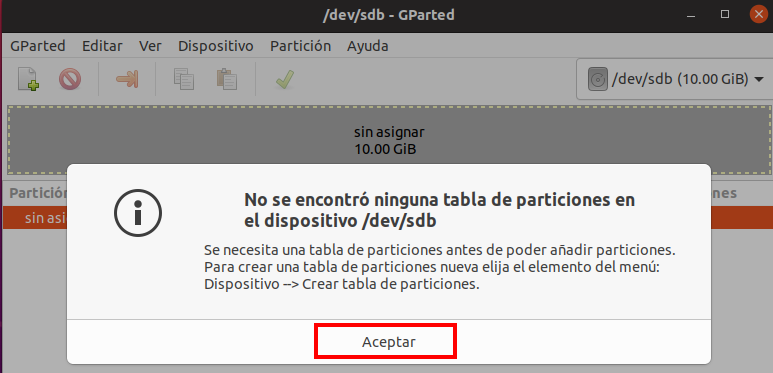
 
 

3 - Nos fijamos en el error y hacemos lo que nos dice ir a , *``DISPOSITIVO``* *``→CREAR TABLA DE PARTICIONES``* . 

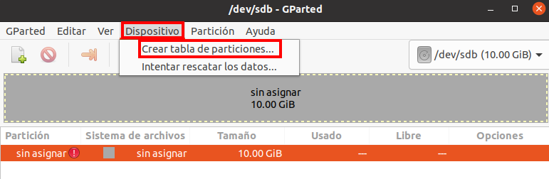
 
 

4 - Nos da distintos tipos pero vamos ha escoger *``GPT``* y aplicamos los cambios de la siguiente manera 

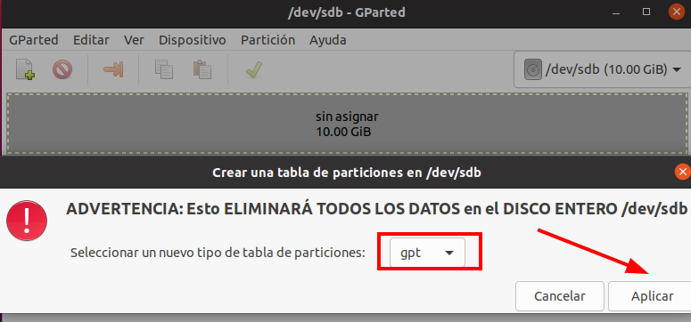
 
 

## 3. Particionando Disco *``gpt``*
 

1 - Creamos la primera partición primaria , con su tamaño , sistema de archivo y su nombre . Y añadimos los cambios .

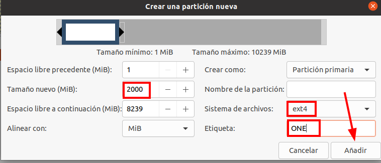
 
 

2 - Como podemos ver esta es la primera partición creada correctamente . Ten en cuenta que siempre hay que marcar la *``FLECHA VERDE``* para que se apliquen los cambios correctamente .

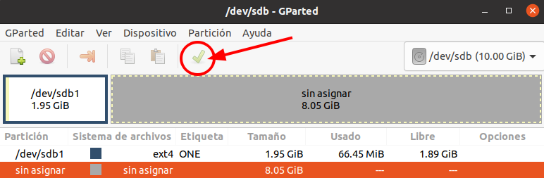
 
 

3 - Y que creamos otra mas con las mimas características pero con distinto nombre .

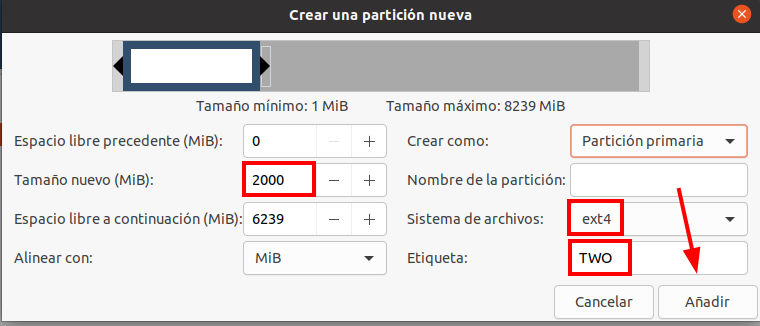
 
 

4 - Tiene que quedar así de la siguiente manera nuestro discos y las particiones que hay en el 

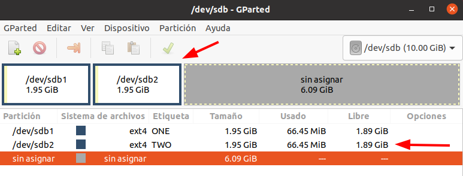
 
 

5 - Intentamos crear una partición extendida , *``NO SE PUEDE``* , porque las particiones extendidas y lógicas no se pueden crear en porque  un disco *``GPT``* estas particiones no son compatibles .

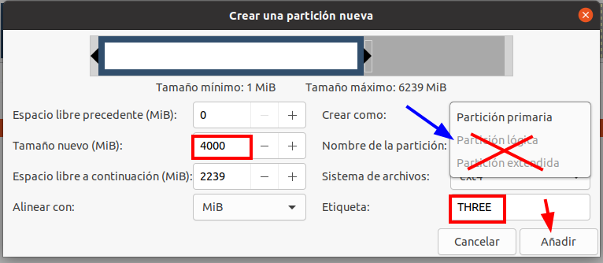
 
 

6 - Entonces creamos dos particiones más , para completar el particionado en el disco , así se tiene que ver el disco correctamente particionado .

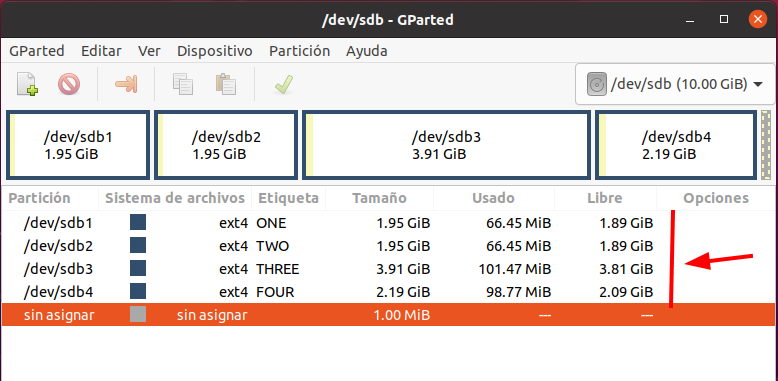
 
 

7 - En el terminal también podemos ejecutar este comando para ver el particionado del disco desde el terminal 

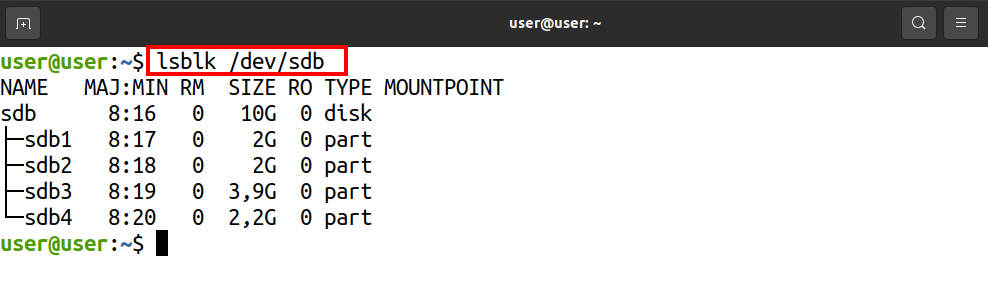
 
 

## 4. Particionando Disco *``mbr``*

1 - Inicializamos el disco en formato *``MBR (Master Boot Record)``* , en sistemas operativos Linux no aparece directamente como *``MBR``* , aparece como *``MSDOS``* que es lo mismo .

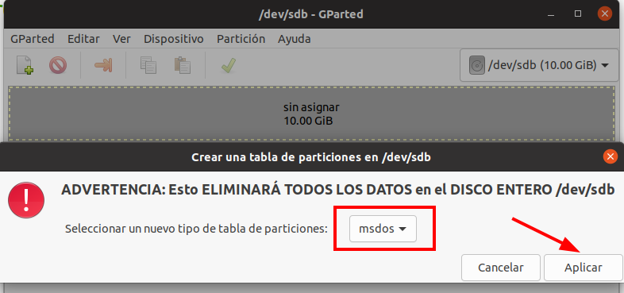
 
 

2 - Creamos la primera partición primaria de la misma manera que antes con todas sus características así de la siguiente manera 

 
 

3 - Creamos una partición extendida , como podemos ver nos deja perfectamente porque es un disco *``MBR``* 

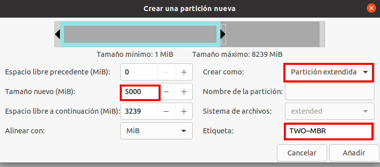
 
 

4 - Aquí esta la partición creada correctamente con sus características 

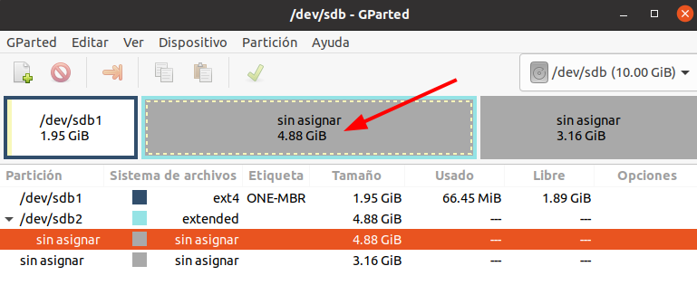
 
 

5 - Entro de la partición extendida creamos dos particiones lógicas

 
 

6 - Tiene que quedar de la siguiente maneta así como se muestra en la imagen , las extendidas tiene un color azul que las distinguen 

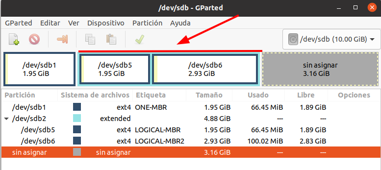
 
 

🧠 **Consejo Final:**

> Aunque la herramienta gráfica Discos es muy intuitiva, haz siempre una copia de seguridad antes de modificar particiones. 💾
>  - 🔐 Algunas funciones requieren privilegios de administrador (te pedirá tu contraseña).
>  - ⚠️ Verifica bien el disco o partición antes de borrar o formatear.
>  - 🧪 Practica en un disco externo o máquina virtual si estás empezando.
> ¡Una buena gestión de discos mantiene tu sistema limpio y funcionando al 100%! 🐧🚀 

