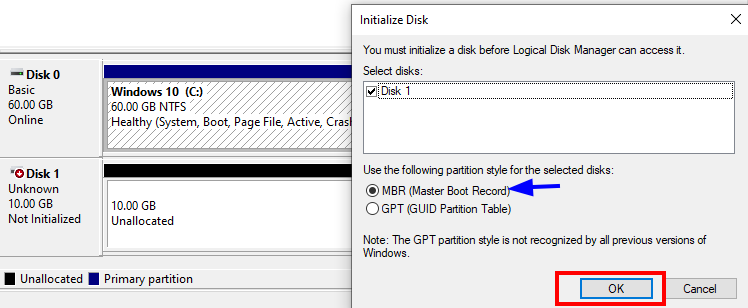
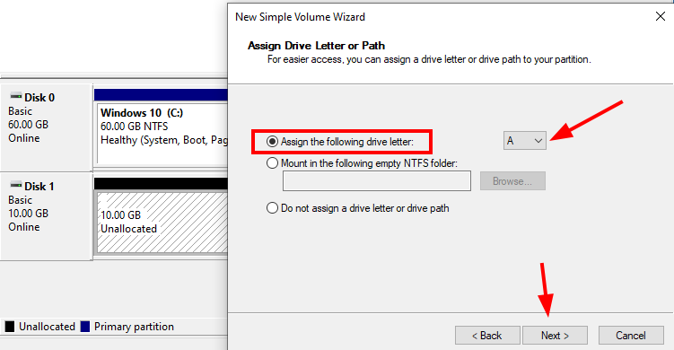
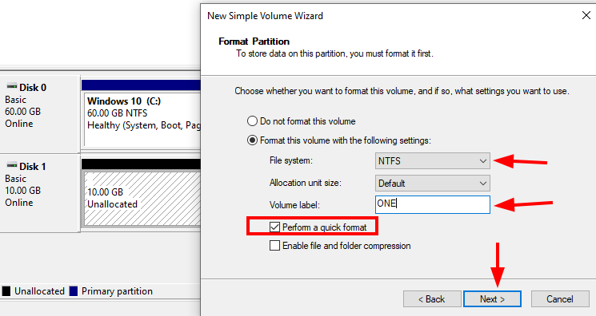
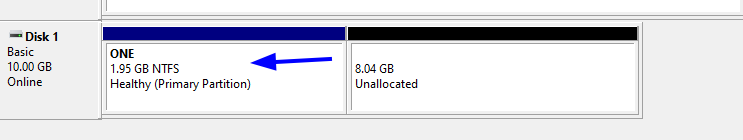

# 📁 **Administrador de discos en Windows**

 
En esta sección aprenderemos a utilizar la herramienta gráfica Administrador de discos que viene integrada en Windows. Veremos cómo:

  - 💻 Visualizar discos y particiones existentes

  - 🆕 Crear, formatear y eliminar particiones fácilmente

  - 🔄 Cambiar letras de unidad y gestionar volúmenes

  - 📊 Interpretar la información básica del disco y solucionar problemas comunes

Esta herramienta es ideal para quienes prefieren una interfaz visual en lugar de usar comandos, facilitando la gestión segura de los discos en Windows.

 

##
## PARTICIONANDO DISCOS

1 - Añadimos un disco nuevo y lo inicializamos el el administrador de discos le damos formato MBR

2 - Damos clic derecho en el disco y creamos una nueva partición simple 

3 - Damos tamaño a la partición de 2000MB y le damos a siguiente  

4 - Asignamos una letra y le damos a siguiente . Esto es para identificarla mejor a la hora de alguna búsqueda 

5 - Formateamos la partición con tipo de NTFS y el nombre que le queremos asignar . Marcamos la casilla de ‘dar formato rápido’ esto es para que no tarde en crear la partición y hacemos clic en siguiente 

6 - Como podemos ver la partición se ha creado correctamente en el disco 

.......................g