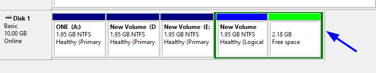
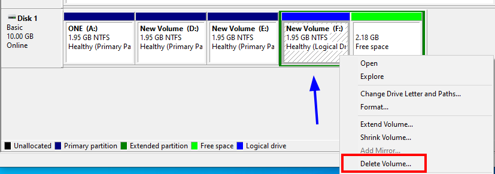
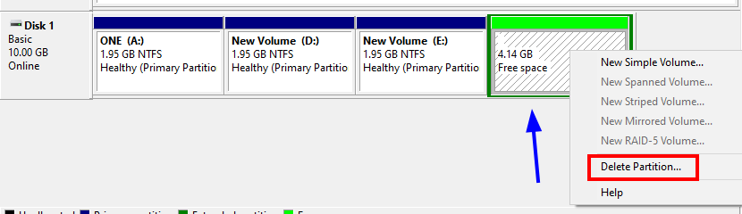
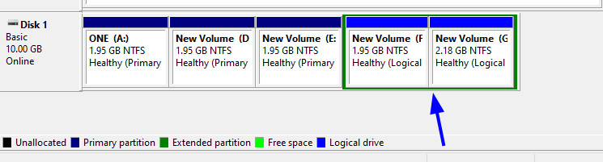

# 🖥️💽🗂️ **Administrador de Discos en Windows**
 

**📑 Indice**
- [🖥️💽🗂️ **Administrador de Discos en Windows**](#️️-administrador-de-discos-en-windows)
  - [📀🧱 Particionando Disco *``mbr``*](#-particionando-disco-mbr)

 
En esta sección aprenderemos a utilizar la herramienta gráfica Administrador de discos que viene integrada en Windows. Veremos cómo:

  - 💻 Visualizar discos y particiones existentes

  - 🆕 Crear, formatear y eliminar particiones fácilmente

  - 🔄 Cambiar letras de unidad y gestionar volúmenes

  - 📊 Interpretar la información básica del disco y solucionar problemas comunes

Esta herramienta es ideal para quienes prefieren una interfaz visual en lugar de usar comandos, facilitando la gestión segura de los discos en Windows.

 

## 📀🧱 Particionando Disco *``mbr``* 

1 - Añadimos un disco nuevo y lo inicializamos el el administrador de discos le damos formato *``mbr``* para realizar estas pruebas 

 
 

2 - Creamos una nueva partición simple , dando clic derecho en el disco nuevo que hemos añadido .

 
 

3 - Ahora le damos tamaño a la partición de *``2000MB``* y continuamos con la configuración dando clic en *``siguiente``* para continuar

 
 

4 - Asignamos una letra . Esto es para identificarla mejor a la hora de alguna búsqueda 

 
 

5 - Formateamos la partición con tipo de *``NTFS``* y el nombre que le queremos asignar . Marcamos la casilla de *``dar formato rápido``* esto es para que no tarde en crear la partición y hacemos clic en siguiente 

 
 

6 - Como podemos ver la partición se ha creado correctamente en el disco 

 
 

7 - Creamos tres particiones más del mismo tamaño . Ahora  creamos una nueva partición , como podemos ver nos crea una partición extendida y luego la lógica .

Esto pasa porque en un disco MBR no pueden haber mas de 3 particiones primarias 

 
 

8 – Hacemos una prueba eliminando la partición lógica que creamos de  la siguiente manera 

 
 

9 – Como podemos ver nos queda un espacio libre , con color verde nos muestra si esta vacía .

 
 

10 - Ahora nos deja la partición extendida solamente dentro de esa creamos dos particiones nuevas que son particiones lógicas . Debe verse así de esta manera 

 
 

⚠️ **Consejo Importante:**
> Antes de modificar particiones en discos *``MBR``*, asegúrate de hacer una copia de seguridad de tus datos. Recuerda que *``MBR``* tiene un límite de 4 particiones primarias, así que planifica bien tu esquema para evitar problemas. ¡Practica en discos de prueba si es posible! 💾🔧

> Fíjate que debajo del disco te muestra de que tipo son las particiones según su color . Por si te pierdes y verificas lo que tienes 🎨