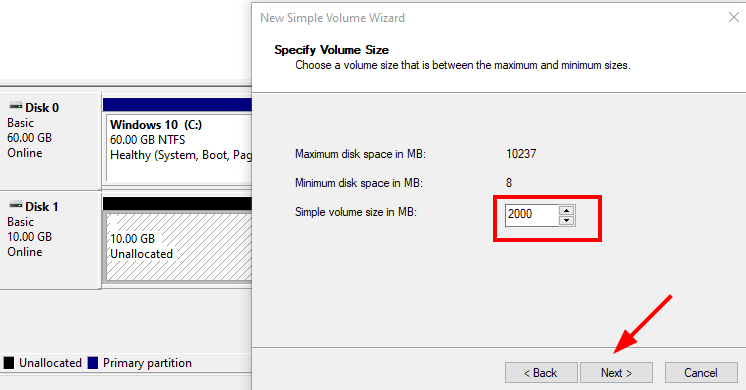

# 🖥️💽🗂️ **Administrador de Discos en Windows**
 

**📑 Indice**
- [🖥️💽🗂️ **Administrador de Discos en Windows**](#️️-administrador-de-discos-en-windows)
  - [📀🧱 Particionando Disco *``mbr``*](#-particionando-disco-mbr)

 
En esta sección aprenderemos a utilizar la herramienta gráfica Administrador de discos que viene integrada en Windows. Veremos cómo:

  - 💻 Visualizar discos y particiones existentes

  - 🆕 Crear , formatear y eliminar particiones fácilmente

  - 🔄 Cambiar letras de unidad y gestionar volúmenes

  - 📊 Interpretar la información básica del disco y solucionar problemas comunes

Esta herramienta es ideal para quienes prefieren una interfaz visual en lugar de usar comandos, facilitando la gestión segura de los discos en Windows.

 

## 📀🧱 Particionando Disco *``mbr``* 
 

1 - Añadimos un disco nuevo y lo inicializamos el el administrador de discos con formato *``mbr``* .

 
 

2 - Creamos una nueva partición simple , haciendo clic derecho en el disco .

 
 

3 - Agregamos tamaño a la partición de *``2000MB``* y continuamos configurando dandole a siguiente .

 
 

4 - Asignamos una letra . Esto es para identificarla mejor a la hora de alguna búsqueda 

 
 

5 - Damos formato *``NTFS``* y un nombre alusivo . Marcamos la casilla  *``dar formato rápido``* (para que tarde menos en formatearla) .

 
 

6 - La partición se ha creado correctamente en el disco . 

 
 

7 - Creamos *``3``* particiones con el mismo tamaño . Después de crearlas creamos una nueva . Nos crea una extendia y luego una lógica . 

*``Esto pasa porque en un disco MBR no pueden haber mas de 3 particiones primarias y por eso se crea la extendia``*

 
 

8 – PRUEBA -> Eliminamos la partición lógica en *``delete volume``* . 

 
 

9 - Nos deja el espacio libre , el color verde nos muestra que esta vacía . 

 
 

10 - Nos deja la partición extendida unicamente , ahí creamos *``2``* particiones nuevas que son particiones *``lógica``* . Deve verse así .

 
 

⚠️ **Consejo Importante:**
> Antes de modificar particiones en discos *``mbr``*, asegúrate de hacer una copia de seguridad de tus datos . Recuerda que *``mbr``* tiene un límite de *``4``* particiones primarias, así que planifica bien tu esquema para evitar problemas . ¡Practica en discos de prueba si es posible! 💾🔧

> Fíjate que debajo del disco te muestra de que tipo son las particiones según su color . Por si te pierdes y verificas lo que tienes 🎨