# 💽📟🛠️ Intérprete de Comandos DISKPART
 

**📑 Indice**
- [💽📟🛠️ Intérprete de Comandos DISKPART](#️-intérprete-de-comandos-diskpart)
- [📘 1. Aspectos Importantes](#-1-aspectos-importantes)
  - [⚙️ 1. Configuración del Virtual-Box](#️-1-configuración-del-virtual-box)
  - [🧱 2. Particionando Disco *``mbr``* con DISKPART](#-2-particionando-disco-mbr-con-diskpart)

 

# 📘 1. Aspectos Importantes 

*``DISKPART``* es una herramienta integrada en Windows que se utiliza desde la línea de comandos. Permite administrar discos duros, memorias *``usb``* y otras unidades de almacenamiento.
Con *``diskpart``* puedes crear, eliminar o modificar particiones (las divisiones internas de un disco).

⚠️ ¡Importante! Hay que tener mucho cuidado al usarla, ya que un mal comando puede borrar toda la información de un disco.

 
 

⚙️ **Funcionamiento de `diskpart`**
 

- 🧭 **Acceder a `diskpart`**

Puedes abrir *``diskpart``* desde el menú de búsqueda de Windows.  Escribe *``"Símbolo del sistema"``* o cmd , haz clic derecho y selecciona *``"Ejecutar como administrador"``*.  Luego, escribe diskpart y presiona *``Enter``* para iniciar la herramienta.

- 💡 **Comandos Principales :**

  ~~~
  list disk           # Listar todos los discos disponibles
  select disk X       # Seleccionar disco (reemplaza X por el número del disco)

  list partition      # Mostrar particiones del disco seleccionado
  select partition X  # Seleccionar partición

  list volume         # Mostrar volúmenes
  select volume X     # Seleccionar volumen
  ~~~

- 🛠️ **Tareas Comunes**

  - 🪚 Crear Particiones
  
  ~~~
  create partition primary     # Crear partición primaria
  create partition extended    # Crear partición extendida
  create partition logical     # Crear partición lógica
  ~~~
  

  - 🧹 Eliminar y limpiar

  ~~~
  delete partition           # Eliminar la partición seleccionada
  clean                      # Borrar todo el contenido del disco seleccionado
  clean all                  # Borrado completo (más profundo)
  ~~~

  - ⚙️ Configurar particiones/discos
    
  ~~~
  format fs=ntfs quick         # Formatear partición como NTFS (rápido)
  format fs=fat32 quick        # Formatear como FAT32 (rápido)
  assign letter=X              # Asignar letra de unidad (reemplaza X)
  label=Nombre                 # Establecer nombre de la partición
  convert gpt                  # Convertir disco a GPT
  detail disk                  # Ver información detallada del disco
  ~~~
   
   

## ⚙️ 1. Configuración del Virtual-Box
 

1 - Añadimos un nuevo disco a nuestro equipo con un tamaño de *``10GB``* . Hazlo de esta manera . 

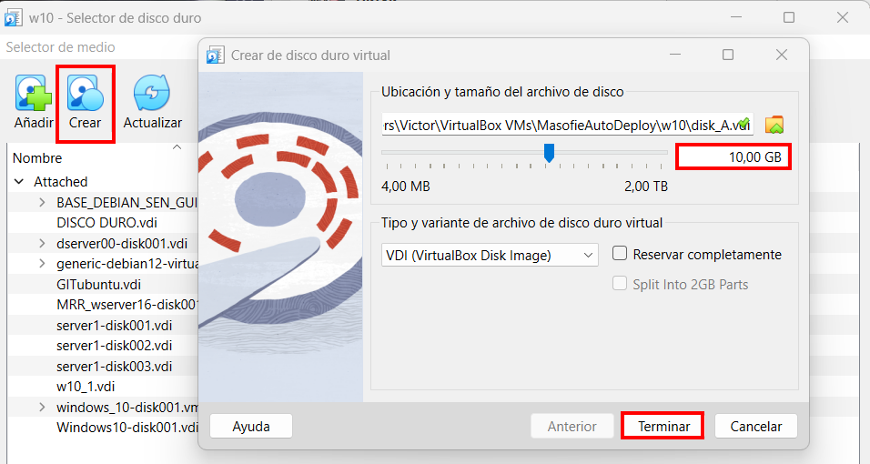
 
 

2 - En el administrador de discos inicializamos el disco , con un formato *``mbr``* . Desde que entras de muestra este mensaje .

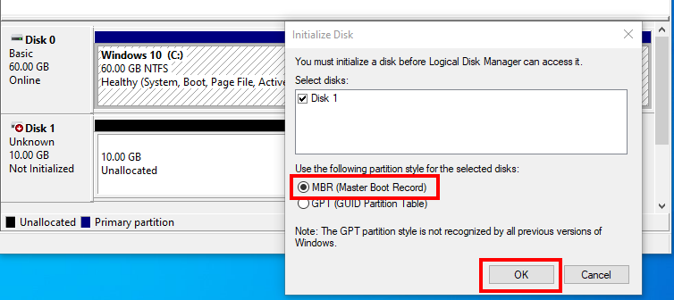
 
 

## 🧱 2. Particionando Disco *``mbr``* con DISKPART
 

1 - Iniciamos como administrador en *``diskpart``* desde el terminal *``(cmd)``*  

~~~~~~~~
# Iniciar diskpart
diskpart
~~~~~~~~

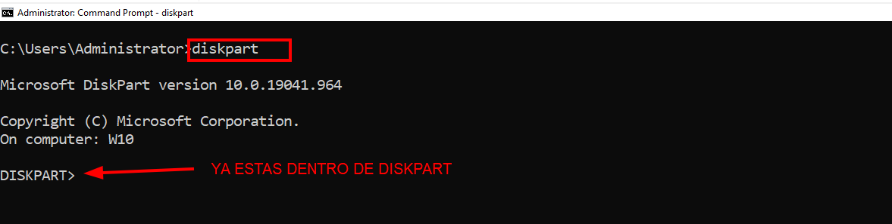
 
 

2 - Una vez entro de *``diskpart``*  listamos (mostramos) los discos 

~~~~~~~~
# Mostrar discos
list disk
~~~~~~~~

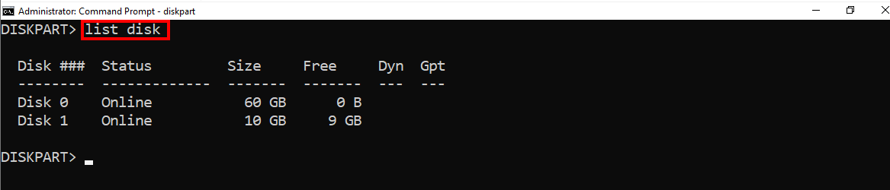
 
 

3 - Seleccionamos el disco llamado *``disk1``* , el disco que tenga el *``(*)``* es el disco seleccionado . Y mostramos el resultado .

~~~~~~~~
# Seleccionar disco
select disk (num)

# Mostrar discos  
list disk
~~~~~~~~

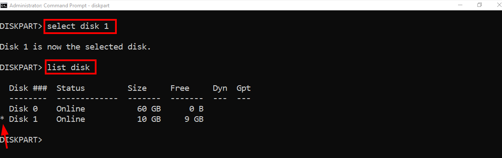
 
 

4 - Creamos una partición de tipo primaria de *``2000MB``*  . Comprobamos las particiones mostrado las que hay creadas .

~~~~~~~~
# Crear partición primaria
 create partition primary size=2000
~~~~~~~~

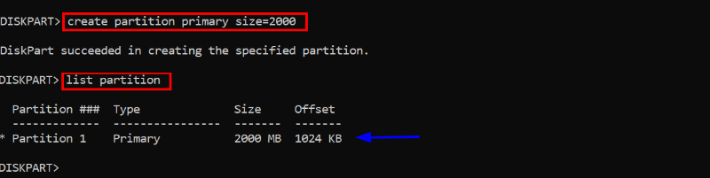
 
 

5 - Creamos *``3``* particiones primarias del mismo tamaño . El disco tiene que tener *``4``* particiones primarias , porque antes creamos otro .

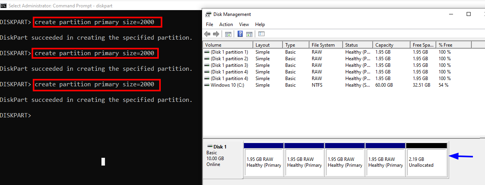
 
 

6 - POSIBLE ERROR ->  Intentamos crear otra partición primaria , ya ves que *``"NO SE PUEDE"``* .

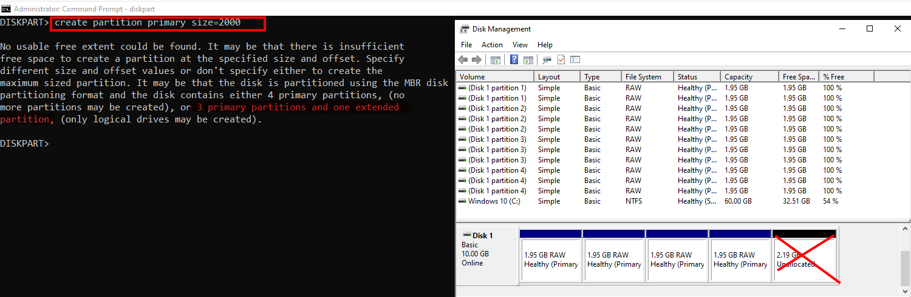
 
 

7 - SOLUCIÓN -> Borramos la ultima partición usando el comando *``delete``*  . Esto hace que en vez de dejar dos particiones vacias , forma una única partición (o sea aumenta su espacio libre) .

~~~~~~~~
# Seleccionar partición
select partition 4

# Borrar partition
delete partition
~~~~~~~~

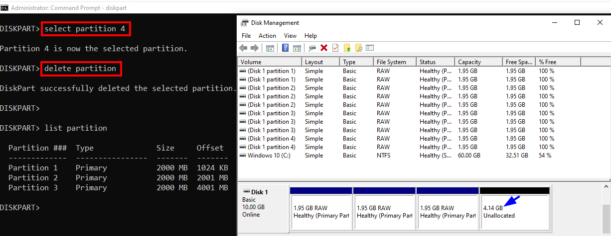
 
 

8 - Creamos una partición extendia con el espacio libre , utilizamos el comando *``extend``* .

~~~~~~~~
# Creación de partición logica 
create partition extend

# Mostrar particiones 
list partition
~~~~~~~~

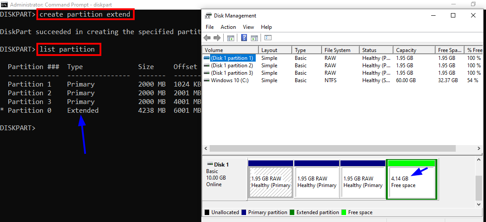
 
 

*``Las particiones extendidas tienen dentro particiones lógicas , por eso dice que hay un espacio libre , aunque hay una partición creada . Cuando se crean las lógicas se llena la extendida``*

 
 

9 - Creamos *``2``* particiones *``lógicas``*  con el comando *``logical``* dentro de la partición extendia , se han creado correctamente .

~~~~~~~~
# Mostramos las particiones

# Seleccionamos la partición
select partition 0

# Creación de partición logica 
create partition logical size=2000
~~~~~~~~

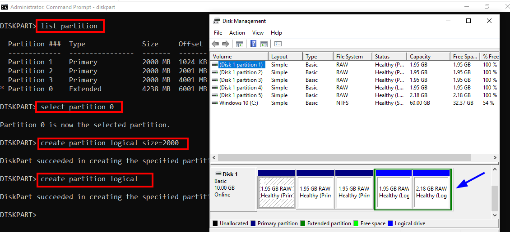
 
 

10 - Mostramos todas las particiones ,  como podemos ver se han creado correctamente todos las particiones

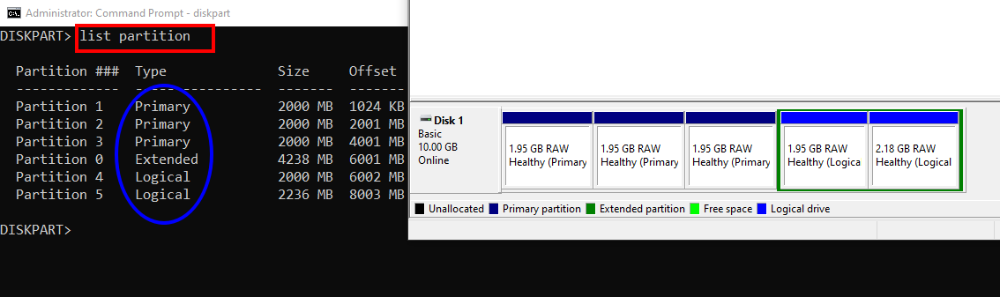
 
 

11 - Si queremos añadir una letra para identificar la partición usamos *``'assign letter=X'``* .

~~~~~~~~
# Asignar letra 
assign letter=A
~~~~~~~~

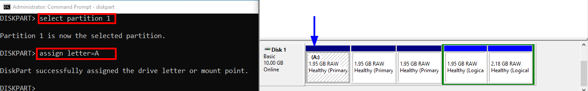
 
 

12 - Comprobamos la letra en la unidad usando *``volume``* , muestra más información sobre las particiones .

~~~~~~~~
# Mostrar volumenes  
list volume
~~~~~~~~

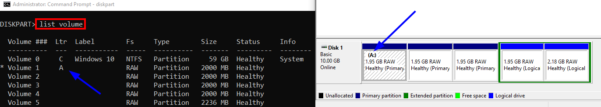
 
 

13 - Para dar nombre a la partición utilizamos **``label``* , para el formato es *``format``* y para que lo haga rápido usamos *``quick``* .

~~~~~~~~
# Dar nombre y formato 
format fs=NTFS label=ONE quick
~~~~~~~~

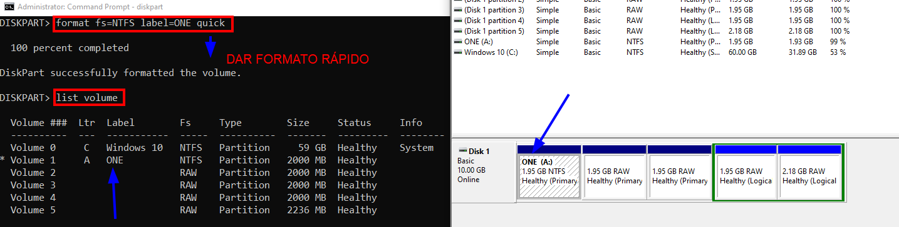
 
 

14 - Neceitas ver la información completa de un disco usamos el comando *``detail``* , para mostrala .

~~~~~~~~
# Ver información de un disco
datail disk
~~~~~~~~

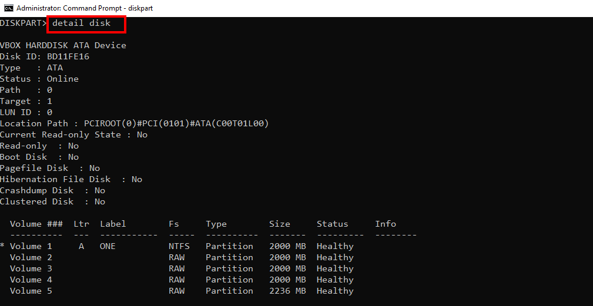
 
 

15 - Para borrar todas las particiones del disco utilizamos *``clean all``* , o sea limpia todo . 

~~~~~~~~
# Borrar particiones
clean all
~~~~~~~~

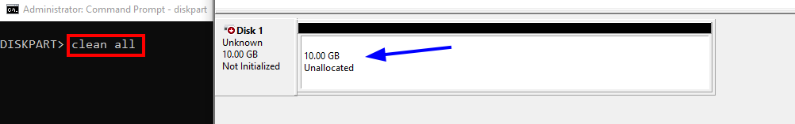
 
 

**¡Último consejo!** 🤓  
>
> 🔐 Ejecuta `diskpart` como *``Administrador``* para evitar restricciones de permisos.  
> ⚠️ Verifica siempre el *``número de disco``* antes de aplicar cambios irreversibles.  
> 💻 Practica en una *``VM``* y repite los comandos para ganar confianza. 💪
