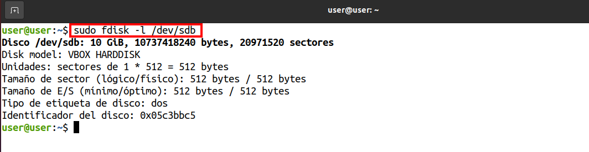
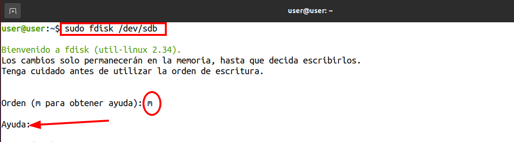
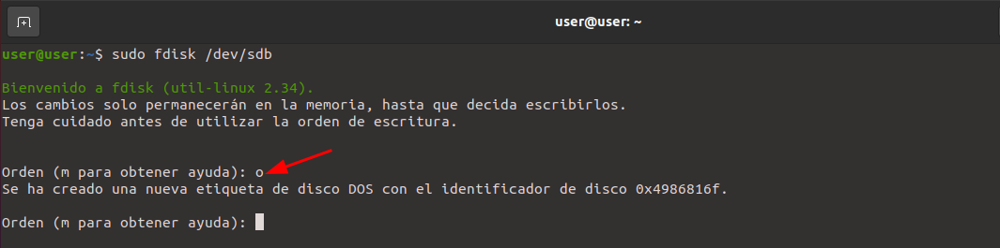
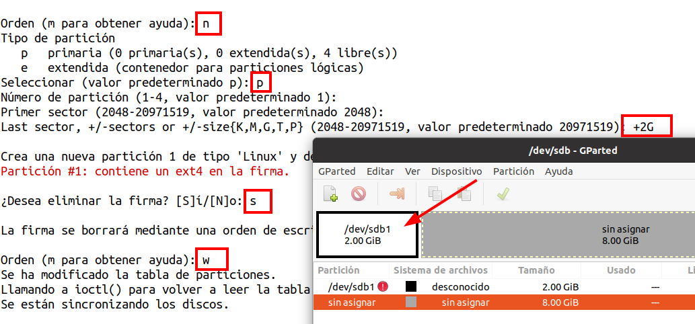
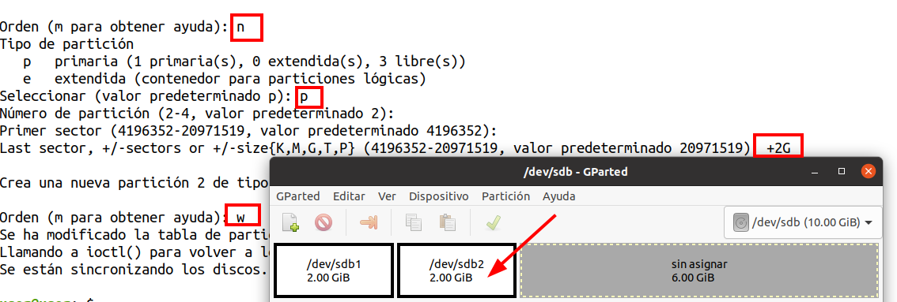
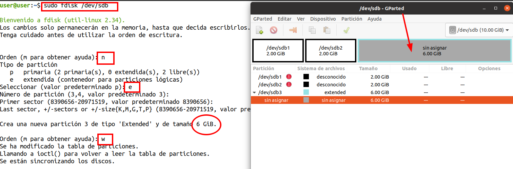
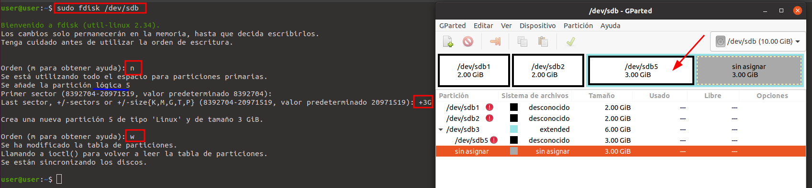

#
# 💽📟🛠️ Guía rápida de *fdisk* en Linux

🧩 **¿Qué es fdisk en Linux?**

fdisk es una herramienta de línea de comandos 🖥️ usada en sistemas Linux para gestionar particiones en discos duros 💽. Con ella puedes:

   - 📋 Ver las particiones existentes

   - ➕ Crear nuevas particiones

   - ❌ Eliminar particiones
s
   - ✏️ Cambiar el tipo o el sistema de archivos

Es especialmente útil cuando trabajas con discos nuevos o al preparar sistemas para instalar Linux. ⚙️

⚠️ Precaución: Usar fdisk incorrectamente puede borrar datos. Siempre haz una copia de seguridad antes de modificar particiones.

# Particionando Disco *mbr* : 

## Primeros Pasos
##

Mostrar el disco en especifico que vamos ha utilizar para crear las particiones y realizar las pruebas , para esto utilizamos el siguiente comando en el terminal , (recuerda utilizar el sudo para tener permisos de administrador) 

~~~~~~~~~~~~~~~~~~~~~~~
sudo fdisk -l /dev/sdb
~~~~~~~~~~~~~~~~~~~~~~~

Si todavía no han usado la herramienta fdisk podemos utilizar la ayuda . Para buscar esta ayuda ejecutamos el siguiente comando en el terminal y marcamos la letra m como nos indica .

~~~~~~~~~~~~~~~~~~~~~~~
sudo fdisk /dev/sdb
~~~~~~~~~~~~~~~~~~~~~~~

Inicializando disco en mbr , utilizando la letra o (crea una nueva tabla de particiones DOS vacía)

## Particionando Disco 
##

Aquí tienes una pequeña ayuda para usar *fdisk* de una manera básica y más sencilla . Con esto te ayudara a enteder su uso

 
> - **Inicializando Disco :**
>    - g = gpt
>    - o = mbr

> - **Creando Particiones :**
>   - n = nueva partición
>   - p = primaria
>   - e = extendida
>   - w = guardar cambios

Creamos una partición primaria de tamaño de 2G y guardamos los cambios así como se muestra en la siguiente imagen 

Creamos otra igual para participar , del mismo tamaño y guardamos los cambios 

Ahora creamos una partición extendida de 6G de tamaño , de la siguiente manera 

Creamos una partición lógica de 3GB de tamaño como podemos ver solo nos da la posibilidad de crear las lógicas porque solo queda vacía la partición extendida 

#

✅ **Sugerencias para usuarios nuevos**

>    - 🔍 Usa lsblk o fdisk -l primero para identificar correctamente tu disco (por ejemplo: /dev/sda, /dev/sdb).
>    - 🧠 Asegúrate de saber qué partición estás modificando antes de confirmar cualquier cambio.
>    - 📝 Aplica los cambios con cuidado. No se escriben en el disco hasta que uses el comando w dentro de fdisk.
>    - 🔒 Usa sudo para acceder a permisos de administrador:    

-    ~~~~~~~~~~~~~~~~~~~~sudo fdisk /dev/sdb 

>    (Reemplaza sdX con el nombre real de tu disco.)
>    📦 Si estás en un sistema UEFI, considera usar gdisk o parted en lugar de fdisk para mejor compatibilidad.