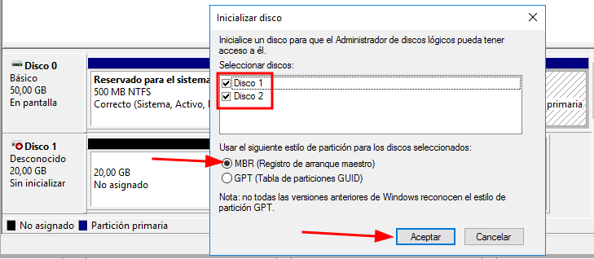
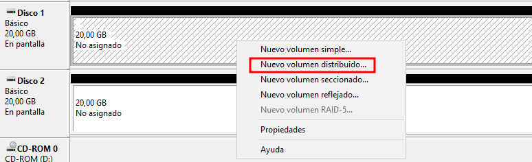
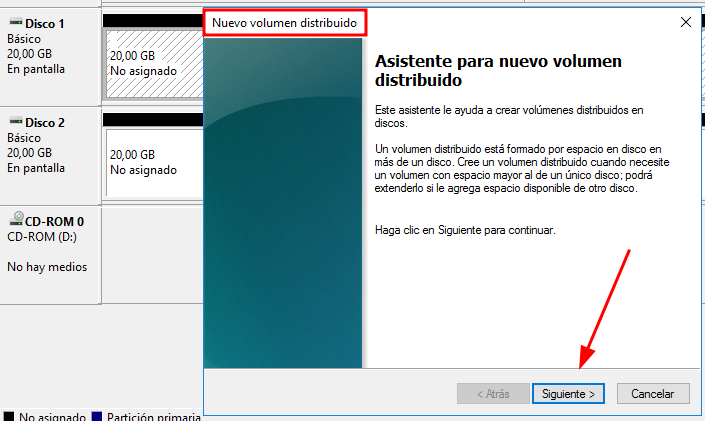
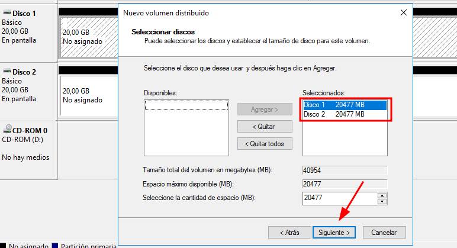
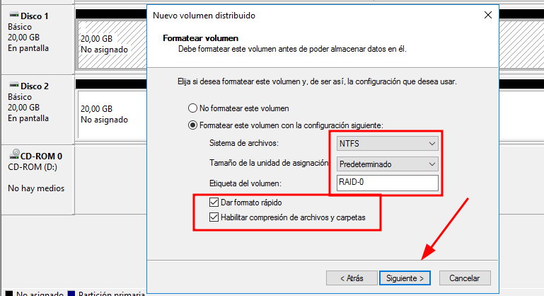
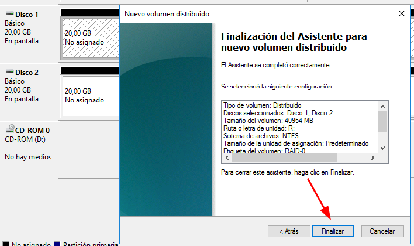

# 💽 RAID: Tipos y Usos
 

**📑 Indice**
- [💽 RAID: Tipos y Usos](#-raid-tipos-y-usos)
  - [🛡️ ¿Qué es RAID?](#️-qué-es-raid)
  - [🧱 Tipos de RAID Explicados](#-tipos-de-raid-explicados)
  - [🖥️ 1. Windows Server](#️-1-windows-server)
    - [🔧 1.1 Configuración de Discos en VirtualBox](#-11-configuración-de-discos-en-virtualbox)
    - [💽 1.2 Crear RAID 0 (Volumen Distribuido)](#-12-crear-raid-0-volumen-distribuido)
  - [💻 2. Windows Cliente (Windows 10/11)](#-2-windows-cliente-windows-1011)

 

## 🛡️ ¿Qué es RAID?
 

``RAID (Redundant Array of Independent Disks)`` es una tecnología que permite combinar múltiples discos duros en una sola unidad lógica con el objetivo de :

- 💨 Aumentar el rendimiento de lectura/escritura

- 🔐 Garantizar la disponibilidad de los datos

- 🧱 Mejorar la tolerancia a fallos en sistemas críticos

 
 

## 🧱 Tipos de RAID Explicados
 

| Nivel RAID | ¿Cómo funciona? 📚                                                                 | Ventajas ✅                              | Desventajas ⚠️                         |
|------------|-------------------------------------------------------------------------------------|------------------------------------------|-----------------------------------------|
| **RAID 0** | Divide los datos entre dos o más discos (striping). Sin redundancia.               | Máximo rendimiento ⚡                     | Si un disco falla, se pierde todo ❌     |
| **RAID 1** | Copia exacta de los datos en dos discos (mirroring).                               | Alta seguridad 🛡️                        | Solo se usa el 50% del total del espacio 💾 |
| **RAID 5** | Datos + paridad distribuidos en 3 o más discos.                                    | Buen balance entre rendimiento y seguridad 🔁 | Más lento en escrituras y recuperación ⚠️ |
| **RAID 10**| Combina RAID 1 (espejo) y RAID 0 (rendimiento). Requiere mínimo 4 discos.          | Redundancia + velocidad 💪               | Coste elevado en hardware 💰             |

 
 

## 🖥️ 1. Windows Server
 

✅ Recomendado para RAID

- Soporta ``RAID`` por software desde el Administrador de discos o Storage Spaces.

- También permite gestionar ``RAID`` por hardware si el servidor tiene un controlador RAID.

- Soporta más niveles ``RAID`` (RAID 0, 1, 5, 10, etc.).

- Ideal para entornos profesionales o empresariales.

 
 

### 🔧 1.1 Configuración de Discos en VirtualBox
 

💡 En VirtualBox, añade al menos ``2`` discos sin formato desde **“Almacenamiento”** y conéctalos al controlador ``SATA`` antes de iniciar la VM .

 
 

### 💽 1.2 Crear RAID 0 (Volumen Distribuido)
 

1 - Abre el administrador de discos con ``diskmgmt.msc`` , inicializa los dos discos nuevos como ``MBR`` o ``GPT`` .

 
 

2 - Selecciona ``Nuevo volumen distribuido`` para comenzar la creación del RAID 0.

 
 

3 - En la ventana que aparece , haz clic en ``siguiente`` para continuar con el asistente.

 
 

4 - Selecciona ``ambos`` discos que quieres incluir en el ``RAID 0`` (mínimo dos discos).

 
 

5 - Asigna una letra de unidad para el nuevo volumen ``(por ejemplo, R:)``.

 
 

6 - Configura el formato como ``NTFS`` , ponle un nombre al volumen ``(ej. RAID-0)`` , y marca ``Formato rápido`` y opcionalmente ``Habilitar compresión``.

 
 

7 - Revisa el resumen y haz clic en ``Finalizar``

 
 

8 - Verifica que el nuevo volumen aparece como un único disco con la letra asignada y el tamaño combinado listo para usar.  

 
 

9 - Acepta la advertencia sobre eliminación de datos para crear el volumen.

 
 

10 - El volumen se ha creado correctamente 

 
 

## 💻 2. Windows Cliente (Windows 10/11)

🔧 Limitado, pero posible

- Solo permite configurar ``RAID`` básicos con Espacios de almacenamiento (Storage Spaces).

- Puedes crear algo similar a ``RAID 0``, ``1`` o ``Mirror`` , pero no tan avanzado ni tan confiable como en un servidor.

- No es adecuado para producción crítica.

 
 

💡 Recomendación:

>Para ``RAID`` serio y confiable, lo mejor es usar Windows Server o bien un sistema Linux especializado.
>Si es solo para pruebas o uso doméstico , **Windows 10/11** con Storage Spaces puede servir.
