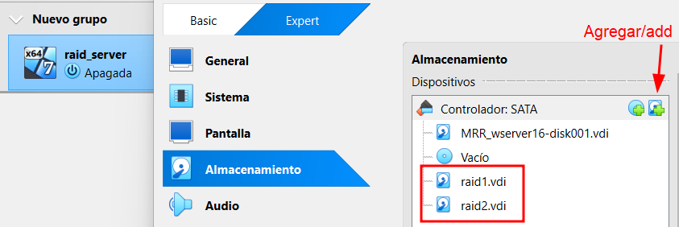
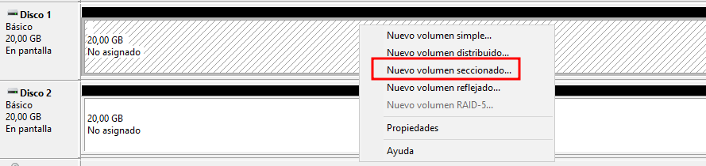
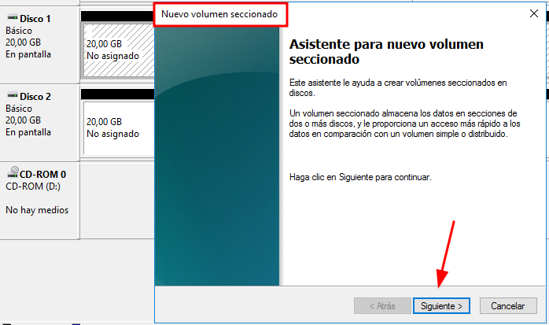
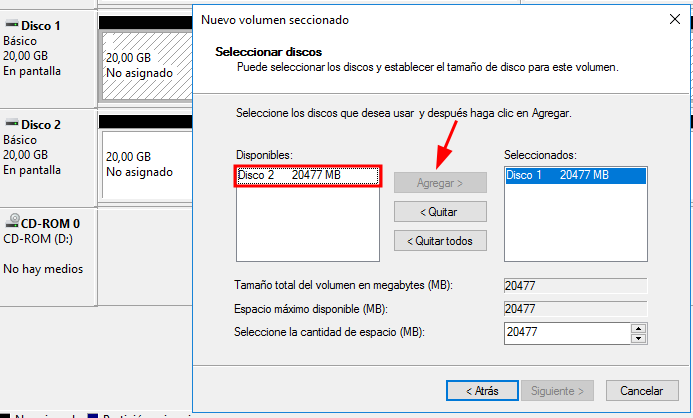
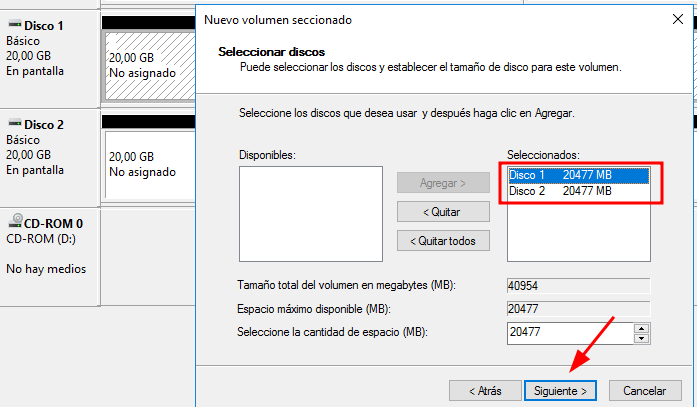
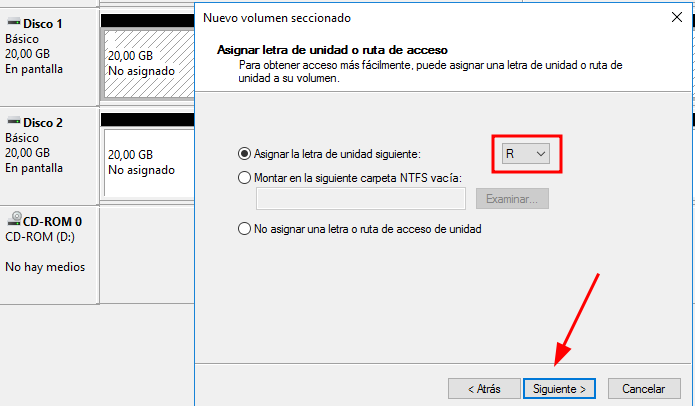

# 💽 RAID: Tipos y Usos
 

**📑 Indice**
- [💽 RAID: Tipos y Usos](#-raid-tipos-y-usos)
  - [🛡️ ¿Qué es RAID?](#️-qué-es-raid)
  - [🧱 Tipos de RAID Explicados](#-tipos-de-raid-explicados)
  - [🖥️ 1. Windows Server](#️-1-windows-server)
  - [🔸 1. RAID 0 - Crear Volumen Distribuido (Administrador de discos)](#-1-raid-0---crear-volumen-distribuido-administrador-de-discos)
    - [📌 1.1 Pasos para configurar RAID 0 en Windows Server:](#-11-pasos-para-configurar-raid-0-en-windows-server)
  - [💻 2. Windows Cliente (Windows 10/11)](#-2-windows-cliente-windows-1011)

 

## 🛡️ ¿Qué es RAID?
 

``RAID (Redundant Array of Independent Disks)`` es una tecnología que permite combinar múltiples discos duros en una sola unidad lógica con el objetivo de :

- 💨 Aumentar el rendimiento de lectura/escritura

- 🔐 Garantizar la disponibilidad de los datos

- 🧱 Mejorar la tolerancia a fallos en sistemas críticos

 
 

## 🧱 Tipos de RAID Explicados
 

| Nivel RAID | ¿Cómo funciona? 📚                                                                 | Ventajas ✅                              | Desventajas ⚠️                         |
|------------|-------------------------------------------------------------------------------------|------------------------------------------|-----------------------------------------|
| **RAID 0** | Divide los datos entre dos o más discos (striping). Sin redundancia.               | Máximo rendimiento ⚡                     | Si un disco falla, se pierde todo ❌     |
| **RAID 1** | Copia exacta de los datos en dos discos (mirroring).                               | Alta seguridad 🛡️                        | Solo se usa el 50% del total del espacio 💾 |
| **RAID 5** | Datos + paridad distribuidos en 3 o más discos.                                    | Buen balance entre rendimiento y seguridad 🔁 | Más lento en escrituras y recuperación ⚠️ |
| **RAID 10**| Combina RAID 1 (espejo) y RAID 0 (rendimiento). Requiere mínimo 4 discos.          | Redundancia + velocidad 💪               | Coste elevado en hardware 💰             |

 
 

## 🖥️ 1. Windows Server
 

✅ Recomendado para RAID

- Soporta ``RAID`` por software desde el Administrador de discos o Storage Spaces.

- También permite gestionar ``RAID`` por hardware si el servidor tiene un controlador RAID.

- Soporta más niveles ``RAID`` (RAID 0, 1, 5, 10, etc.).

- Ideal para entornos profesionales o empresariales.

 
 

## 🔸 1. RAID 0 - Crear Volumen Distribuido (Administrador de discos)
 

### 📌 1.1 Pasos para configurar RAID 0 en Windows Server:
 

1 - Crear discos virtuales en VirtualBox

    Abre la configuración de tu VM y añade dos discos duros vacíos desde el controlador SATA.

    Asegúrate de que no tengan formato previo.

 
 

2 - Inicializar los discos

    Arranca la VM e ingresa a Administrador de discos (diskmgmt.msc).

    Al detectar los nuevos discos, el sistema te pedirá inicializarlos.

    Selecciona el estilo de partición: MBR o GPT, según el caso.

 
 

3️ - Crear el volumen distribuido (RAID 0)

    Haz clic derecho sobre uno de los discos sin asignar → Nuevo volumen distribuido...

 
 

    Se abre el asistente:

        Selecciona ambos discos → clic en Siguiente

 
 

        Asigna una letra (por ejemplo E:)

 
 

        Elige:

            Formato: NTFS

            Nombre del volumen: RAID_0

            ✅ Puedes activar "Habilitar compresión de archivos y carpetas" si lo deseas.

            Marca la casilla de formato rápido

 
 

    Acepta la advertencia de que se borrarán los datos y finaliza.

 
 

    🎉 El volumen se mostrará como Distribuido (RAID 0).

 
 

## 💻 2. Windows Cliente (Windows 10/11)

🔧 Limitado, pero posible

- Solo permite configurar ``RAID`` básicos con Espacios de almacenamiento (Storage Spaces).

- Puedes crear algo similar a ``RAID 0``, ``1`` o ``Mirror`` , pero no tan avanzado ni tan confiable como en un servidor.

- No es adecuado para producción crítica.

 
 

💡 Recomendación:

>Para ``RAID`` serio y confiable, lo mejor es usar Windows Server o bien un sistema Linux especializado.
>Si es solo para pruebas o uso doméstico , **Windows 10/11** con Storage Spaces puede servir.
