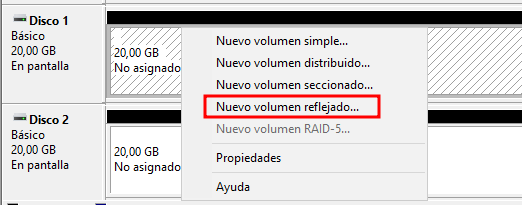
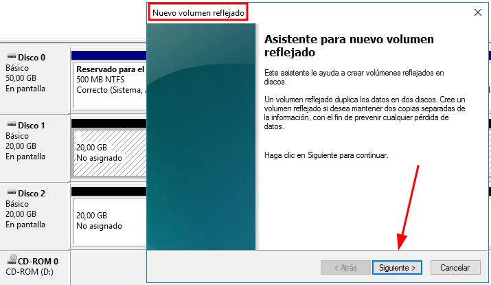
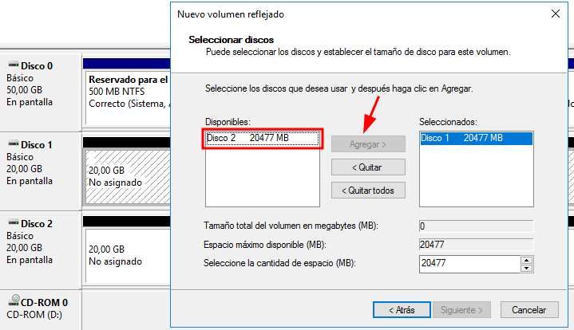
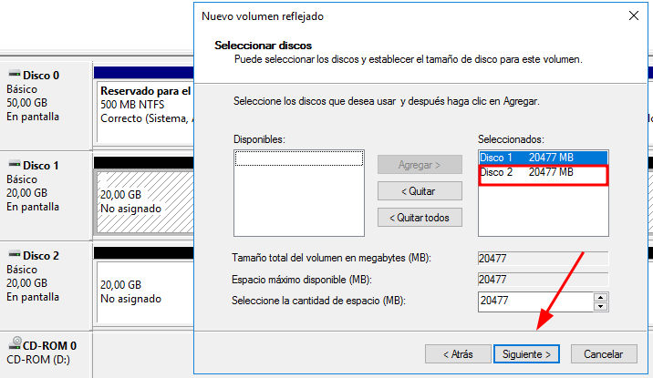
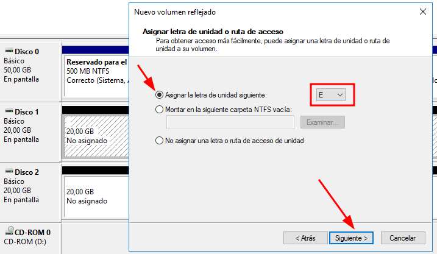
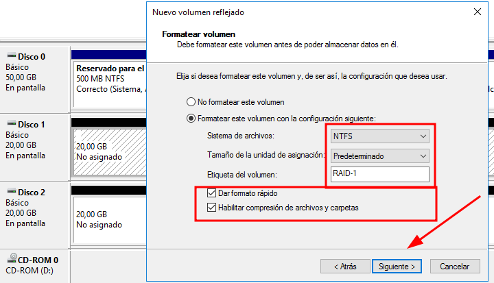
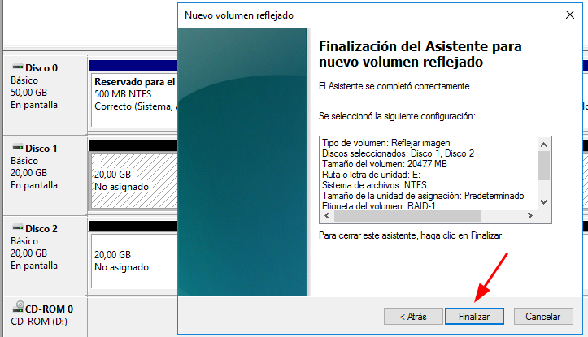
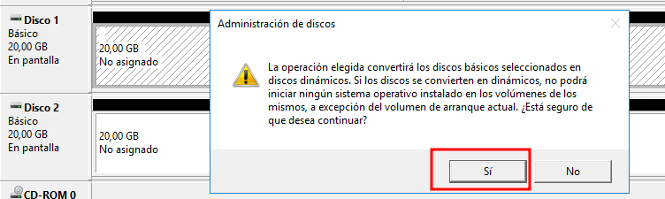
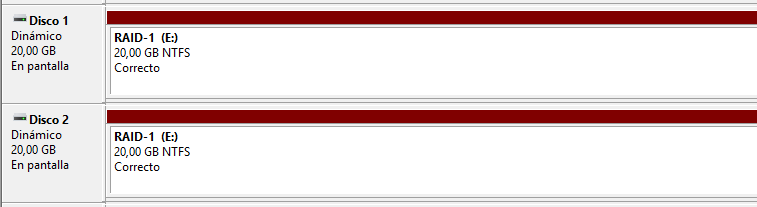

# 💽 🔁 RAID-1 – Crear Volumen Reflejado (Mirroring)
 

**📑 Indice**
- [💽 🔁 RAID-1 – Crear Volumen Reflejado (Mirroring)](#--raid-1--crear-volumen-reflejado-mirroring)
  - [📋 Pasos para configurar ``RAID-1``](#-pasos-para-configurar-raid-1)

 

## 📋 Pasos para configurar ``RAID-1``
 

1️⃣ Seleccionamos la opción Volumen reflejado desde el Administrador de discos.

   

2️⃣ Avanzamos con el asistente que se abre para comenzar la configuración.

   

3️⃣ En la sección de discos disponibles, agregamos el segundo disco necesario para el espejo.

   

4️⃣ Tras añadirlo, seguimos con los pasos del asistente.

   

5️⃣ Asignamos una letra de unidad para identificar el volumen fácilmente.

   

6️⃣ Elegimos el formato NTFS, asignamos un nombre al volumen y activamos la compresión de archivos si lo deseamos.

   

7️⃣ Revisamos el resumen de la configuración para asegurarnos de que todo esté correcto y hacemos clic en Finalizar.

   

8️⃣ ⚠️ Aparecerá una advertencia sobre la conversión a discos dinámicos; aceptamos para continuar.

   

9️⃣ ✅ ¡RAID 1 creado con éxito! Tendrás una única unidad reflejada en dos discos para mayor seguridad.

