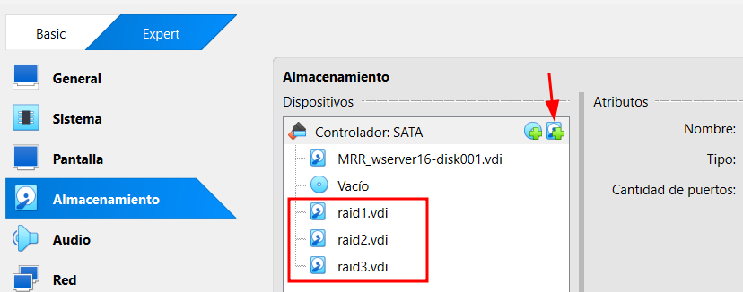
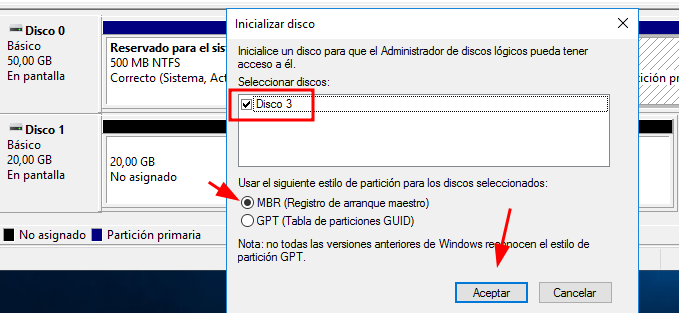
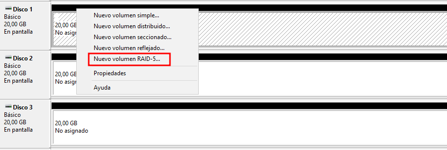
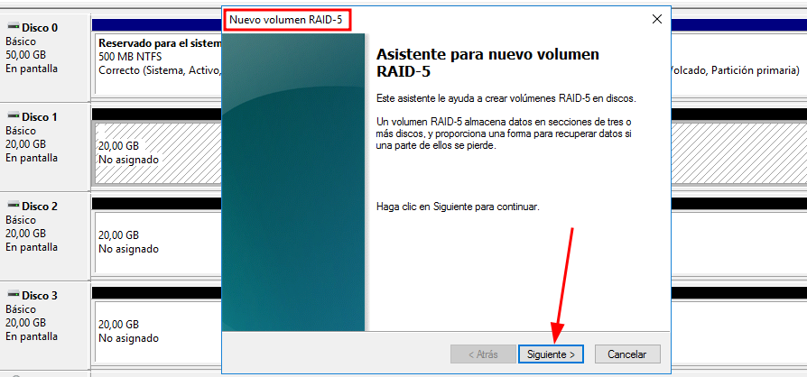
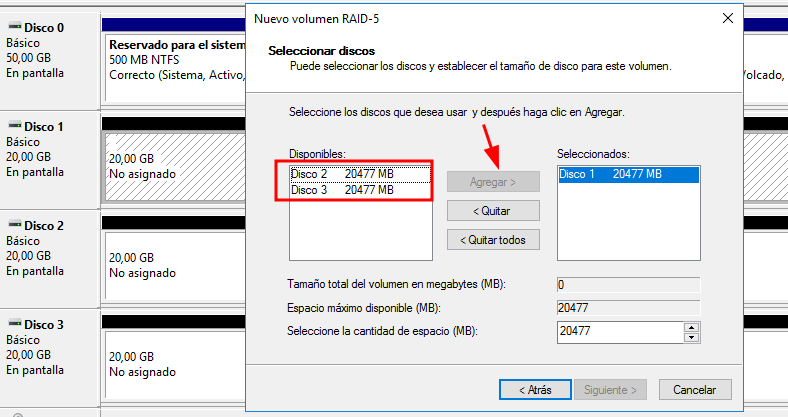
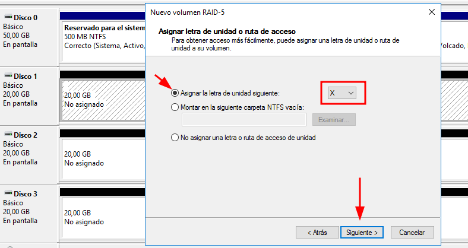
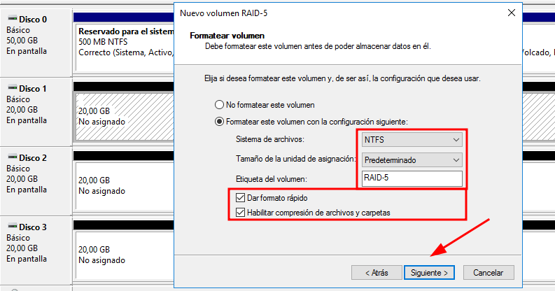
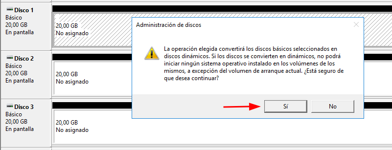
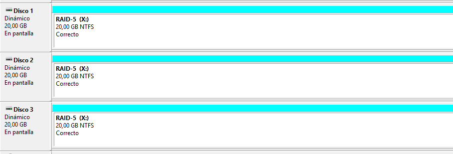

# 💽 🧩 RAID-5 – Crear Volumen con Paridad Distribuida
 

**📑 Indice**
- [💽 🧩 RAID-5 – Crear Volumen con Paridad Distribuida](#--raid-5--crear-volumen-con-paridad-distribuida)
  - [📋 Pasos para configurar ``RAID-5``](#-pasos-para-configurar-raid-5)

 

## 📋 Pasos para configurar ``RAID-5``
 

1️⃣ Añadimos un nuevo disco al equipo para alcanzar un mínimo de ``3`` discos, requisito esencial para ``RAID-5``.

   

2️⃣ Abrimos el administrador de discos e ``inicializamos`` los discos nuevos si aún no lo están.

   

3️⃣ Hacemos clic derecho sobre uno de los discos y seleccionamos ``nuevo volumen`` ``RAID-5``.

   

4️⃣ Se abre el asistente de configuración , avanzamos haciendo clic en ``siguiente``.

   

5️⃣ Por defecto se selecciona el primer disco ,  añadimos los otros ``dos`` para completar el conjunto ``RAID``.

   

6️⃣ Una vez seleccionados los tres discos , hacemos clic en ``siguiente`` para continuar.

   

7️⃣ Asignamos un ``nombre`` , una ``letra`` de unidad , elegimos formato ``NTFS`` y activamos la ``compresión`` si lo deseamos.

   

8️⃣ Revisamos el resumen final para confirmar que todo esté correcto y pulsamos ``finalizar``.

   

9️⃣ Aparecerá una ⚠️ ``advertencia`` sobre la conversión de los discos a dinámicos; aceptamos para proceder.

   

🔟 ¡``RAID-5`` creado con éxito ✅! El volumen aparecerá como una unidad única con paridad distribuida para tolerancia a fallos.

   

**📌 Final del apartado RAID 5**

``RAID-5`` combina rendimiento y seguridad, distribuyendo los datos junto con la información de paridad.
- 🔁 Si un disco falla, el sistema puede reconstruir los datos sin perder información.
- ⚠️ Requiere mínimo tres discos y puede ser más lento en operaciones de escritura y recuperación.