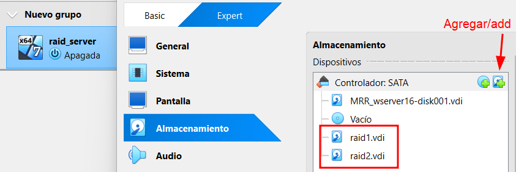
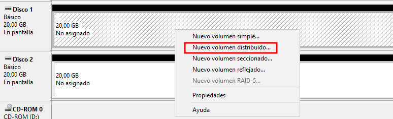
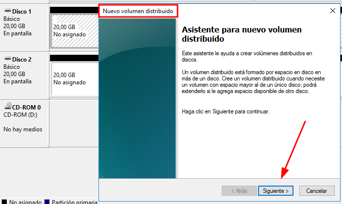
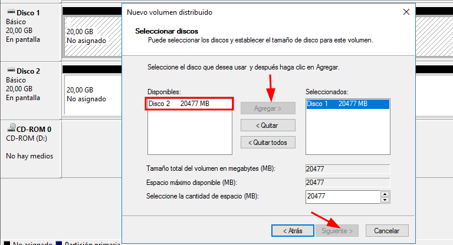
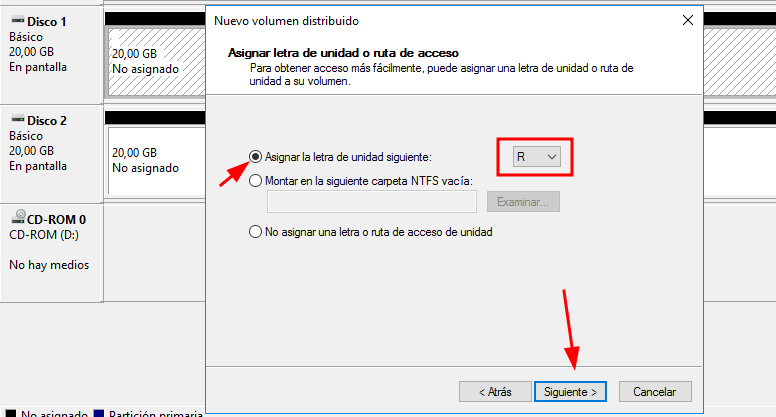
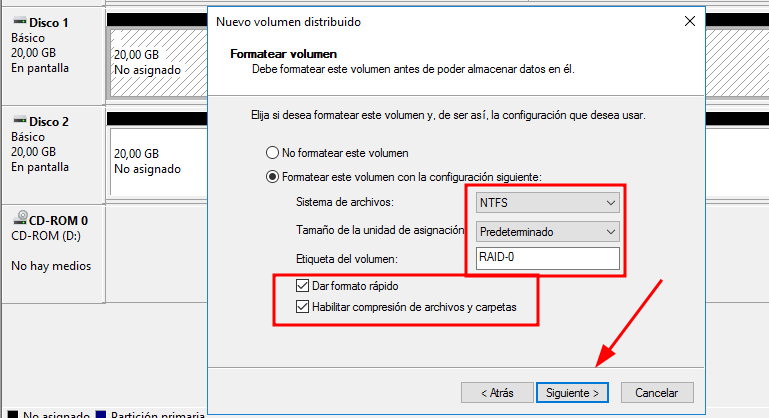
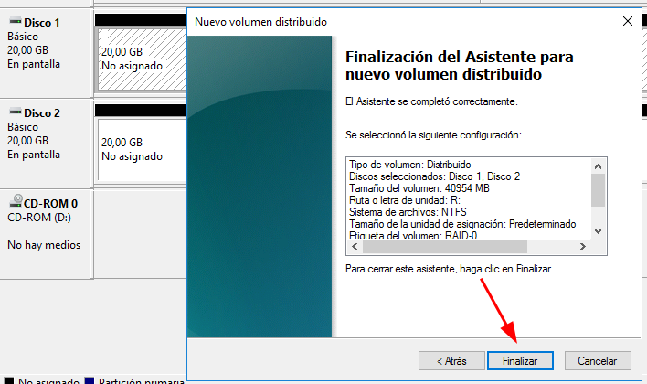
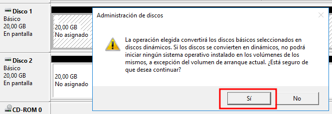
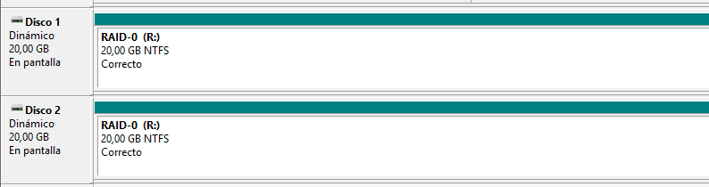

# 💽 RAID-0
 

**📑 Indice**
- [💽 RAID-0](#-raid-0)
    - [🔧 1.1 Configuración de Discos en VirtualBox](#-11-configuración-de-discos-en-virtualbox)
    - [💽 1.2 Crear RAID-0 (Volumen Distribuido)](#-12-crear-raid-0-volumen-distribuido)

 
 

### 🔧 1.1 Configuración de Discos en VirtualBox
 

💡 En VirtualBox, añade al menos ``2`` discos sin formato desde **“Almacenamiento”** y conéctalos al controlador ``SATA`` antes de iniciar la ``VM`` .

 
 

### 💽 1.2 Crear RAID-0 (Volumen Distribuido)
 

1 - Abre el administrador de discos con ``diskmgmt.msc`` , inicializa los dos discos nuevos como ``mbr`` o ``gpt`` . Dependiendo simpre de tu equipo.

 
 

2 - Selecciona ``Nuevo volumen distribuido`` para comenzar la creación del ``RAID-0``.

 
 

3 - En la ventana que aparece , haz clic en ``siguiente`` para continuar con el asistente.

 
 

4 - Selecciona ``ambos`` discos que quieres incluir en el ``RAID-0`` (mínimo dos discos).

 
 

5 - Asigna una letra de unidad para el nuevo volumen ``(por ejemplo, R:)``.

 
 

6 - Configura el formato como ``NTFS`` , ponle un nombre al volumen ``(ej. RAID-0)`` , y marca ``Formato rápido`` y opcionalmente ``Habilitar compresión``.

 
 

7 - Revisa el resumen de la configuración y haz clic en ``Finalizar``

 
 

8 - Verifica que el nuevo volumen aparece como un único disco con la letra asignada y el tamaño combinado listo para usar.  

 
 

9 - Acepta la ⚠️ advertencia sobre eliminación de datos para crear el volumen.

 
 

10 - El volumen se ha creado correctamente fijate que los dos tienen el mismo color.

